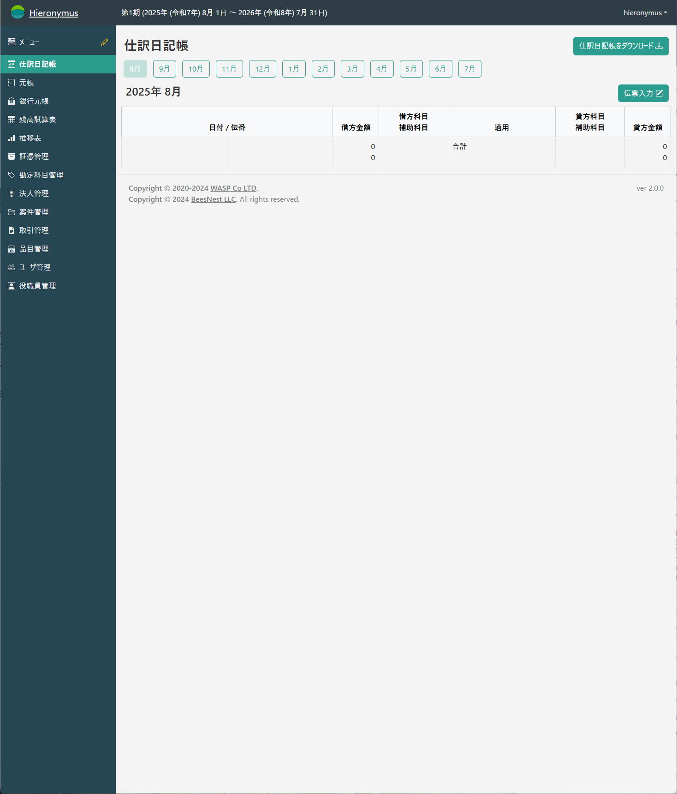
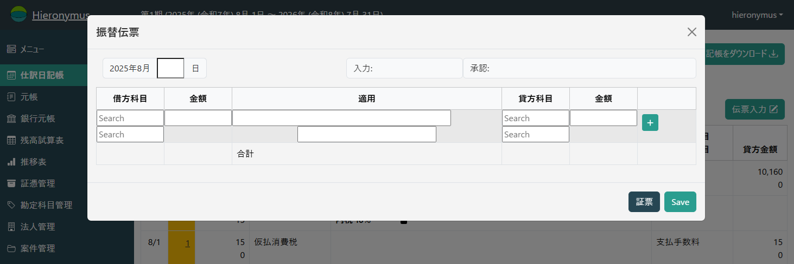

# Hieronymus

Hieronymusは零細企業用のERPシステムです。

現在のところ

* 会計
  * 基本的な会計機能(財務会計)
  * 新電帳法対応の証票管理機能
* 顧客管理
  * 取引先情報の基本的な管理
  * 案件管理
  * 見積/請求/営業活動

が実装されています。

弊社の業務で必要となった機能を中心に開発している、**現在実戦投入中**のシステムです。

## 使い方

[マニュアル](./documents/index.md)を参照してください。

## 機能

### 仕訳日記帳
伝票入力等の基本画面です。  
入力した伝票の閲覧、伝票の入力(修正)が可能です。

伝票入力時に、貸方の金額については以下の省略入力ができます。
これにより、入力の手間を省くと共に入力間違いを減らすことができます。

* `=` 借方と同じ金額が貸方に入ります
* `-` 貸方の合計と借方の合計との差額が貸方に入ります

いずれも既に入力した値が正しくなければ、その伝票は整合性を持って間違えてしまいます。
これはエラーチェックが1つ減るという意味なので、両刃の剣であることに注意して使って下さい。

### 元帳
総勘定元帳と補助元帳が複合した画面です。  
科目及び補助科目毎の明細が表示されます。  
ここから直接伝票を修正することも可能です。

### 銀行元帳

基本的には元帳画面と同じですが、預金通帳を模した表示となっています。  
主には会計データと預金通帳の整合を確認するためのものです。

### 残高試算表

残高試算表が確認できます。

### 法人管理

会計システムに出現する取引先を登録します。  
この情報は、次の**証票管理**で使われます。 

### 証憑管理

電子化証憑を登録できます。  
ここで登録した証憑は、伝票入力の時に結合させることができます。
伝票に証票が結合された場合、伝票明細が表示される画面で参照(ダウンロード)が可能になります。

## ロードマップ

### 次期メジャーバージョンアップ

次期メジャーバージョンアップの時には、「台帳管理システム」が追加されます。
これは「なんとか台帳」を定義して、顧客とのやりとりの記録に使うためのノーコード(ローコード)システムです。

### その後

* 勤怠給与システム

  おそらくその頃には弊社もそのようなものが必要となると思いますｗ

* 経費精算

  プロジェクトや業務毎の経費精算、あるいは旅費精算等も含みます

## その他

プルリク待ってますｗ
