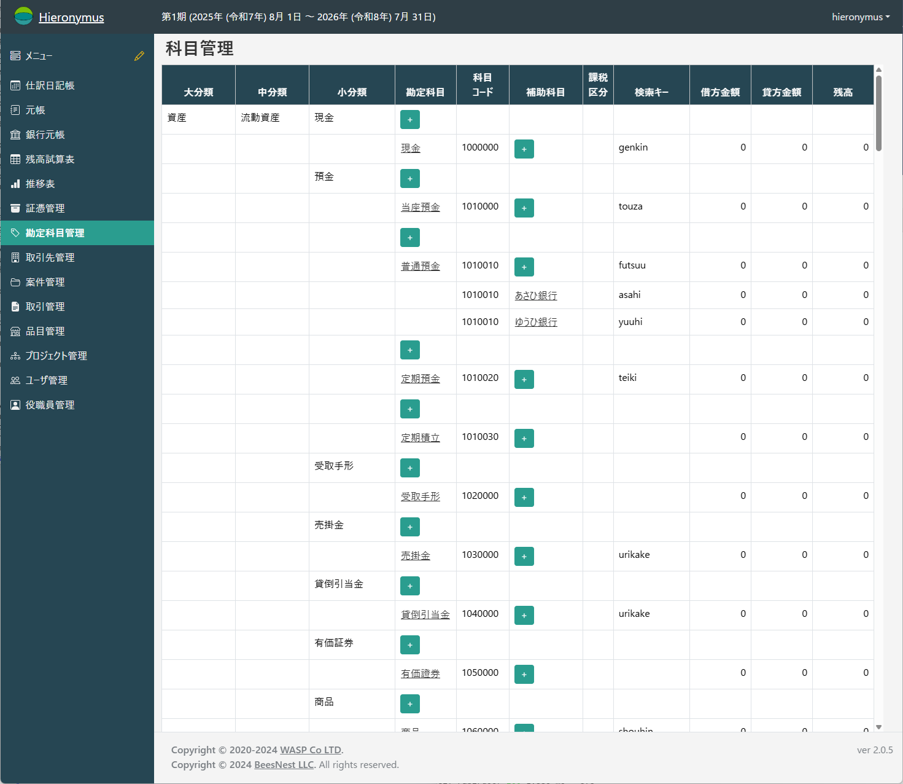
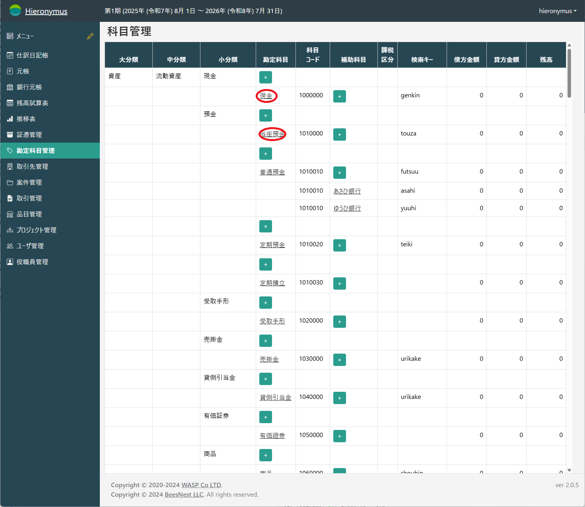
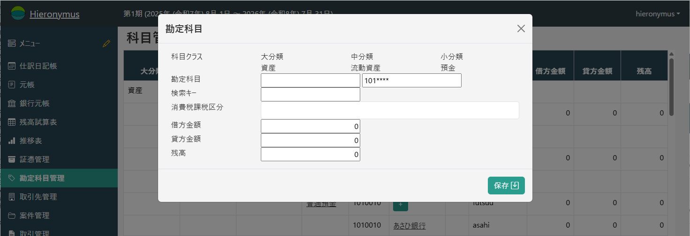
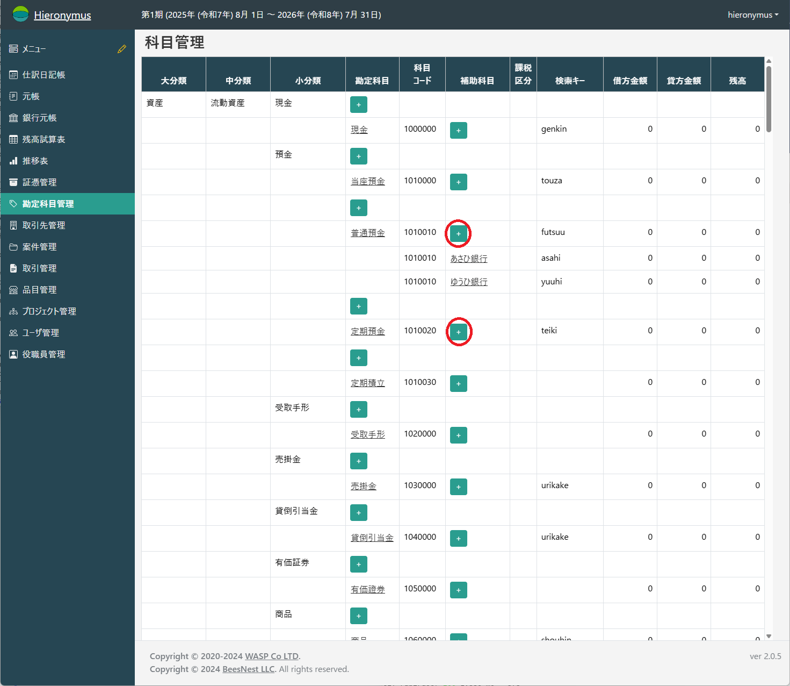
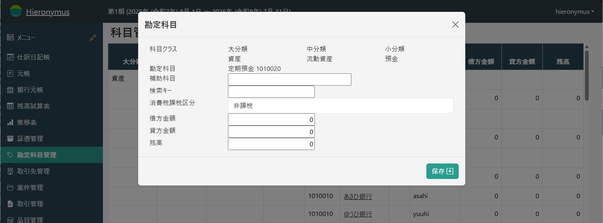

# 勘定科目管理

勘定科目は、会計処理の基本となる分類項目です。Hieronymusでは、資産・負債・純資産・収益・費用の5大分類に基づき、科目を階層的に管理することができます。

「勘定科目管理」画面では、これらの勘定科目を一覧で確認し、新規作成や編集、補助科目の設定などを行います。

## 勘定科目の一覧

左のメインメニューから「マスタ管理」>「勘定科目」を選択すると、登録されている勘定科目が一覧で表示されます。

勘定科目は「大分類」「中分類」「小分類」の階層でグループ化されており、それぞれの科目の借方・貸方合計や現在の残高を確認できます。

## 勘定科目の作成と編集

### 新規作成

新しい勘定科目を追加するには、追加したい分類の行にある「勘定科目」列の青い「+」ボタンをクリックします。

クリックすると、勘定科目の入力モーダルが表示されます。

### 編集

既存の勘定科目を編集するには、一覧でその科目の名前（青いリンク）をクリックします。

クリックすると、選択した科目の情報が入力された状態でモーダルが表示されます。

### 入力項目

モーダルでは以下の項目を設定します。

*   **勘定科目**: 科目の名称です。（例: 「現金」「売上」など）
*   **科目コード**: 科目を一意に識別するためのコードです。新規作成時は、分類に基づいて自動で提案されますが、変更も可能です。
*   **検索キー**: 伝票入力時に科目を素早く探し出すためのショートカットキーです。
*   **消費税課税区分**: この科目に適用される消費税の区分を選択します。
*   **借方金額 / 貸方金額 / 残高**: 期首残高を設定します。通常は、年度締め処理によって自動で計算・繰越されるため、直接編集する必要はありません。

## 補助科目

一つの勘定科目を、さらに詳細に管理したい場合（例: 「普通預金」を銀行ごとに分けるなど）は、「補助科目」を利用します。

### 補助科目の新規作成

補助科目を追加したい勘定科目の行にある、「補助科目」列の青い「+」ボタンをクリックします。

### 補助科目の編集

一覧で編集したい補助科目の名前（青いリンク）をクリックします。

### 入力項目

補助科目のモーダルでは、勘定科目の情報に加えて、補助科目名を入力します。

*   **補助科目**: 補助科目の名称です。（例: 「A銀行」「B銀行」など）
*   その他の項目（検索キー、消費税課税区分、残高）は、補助科目ごとに個別に設定できます。

すべての情報を入力したら、「保存」ボタンで登録を完了します。
