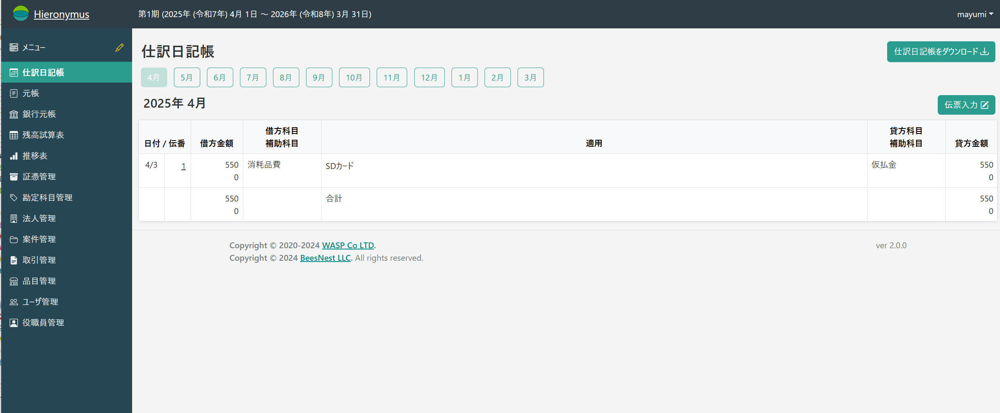
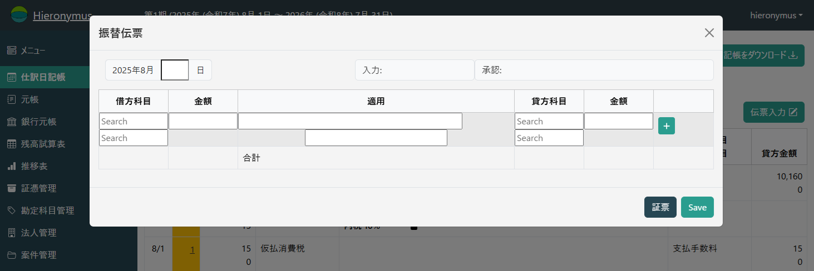

# 伝票と証憑の入力

Hieronymusは「振替伝票」を中心として会計業務を行うシステムです。
つまり、振替伝票を正しく入力することが業務の中心です。

そして、振替伝票を入力する流れとして、

* 伝票入力が初めにあり、必要に応じて証憑を入力する
* 証憑入力が初めにあり、その後伝票を起こす

という2つの流れがあります。

前者は主に会計業務を担当する人が行う方法であり、後者は主に現場で取引を行う人が行う方法です。
どちらがどうということはありませんが、「どちらかである」と認識することが、業務をスムーズに行うために必要です。
もちろんどちらの方法もゴールは「振替伝票を正しく入力する」ことですし、作られる振替伝票は同じものです。

ただし、全ての伝票に証憑があるとは限りませんし、必要だとは限りません。
証憑が必要なのは、主には対外的な商取引の時です。
それ以外の業務については、特に証憑は必要ではありません。

また多くの場合、現場の人達が会計を意識するのは対外的な取引がある時ですから、対外的に取引をした証憑は「とりあえず入力」というように依頼しておくのが、会計処理をスムーズに行うポイントです。

## 伝票入力が最初に行われるパターン

### 伝票本体の入力

社内での資金移動(口座間の振替とか)のように、特に証憑が存在しない業務の伝票を入力する場合、「伝票入力」を中心とした作業手順が適当です。

一般的な伝票入力には、まず「仕訳日記帳」を開きます。

そして、2行目に表示されている「月」から、これから入力する伝票の「月」を選択します。

.png)

そして、3行目の右端にある「伝票入力」をクリックします。
すると、「振替伝票」のポップアップが表示されます。

このポップアップの中で、振替伝票を入力することとなります。

振替伝票の初期の入力欄は、

* 日
* 借方科目(借方補助科目)
* 借方金額
* 適用
* 貸方科目(貸方補助科目)
* 貸方金額

です。

なお、**借方科目と借方金額が通常の振替伝票と逆**になっている点は注意してください。
これは、金額入力の際の消費税入力の都合です。
通常、**勘定科目が確定しないと消費税の要否や税率が確定しない**ので、「まずは科目を確定させる」という手順になっているためです。

「科目」の入力欄に「呼び出しキー」を入力すると、その下にプルダウンメニューが表示され、選択可能になります。

.png)

このプルダウンメニューから、科目を選択します。

.png)

選択すると確定され、入力欄に表示されます。

.png)

補助科目も同様です。

.png)

確定させます。

.png)

科目を入力したら、金額を入力します。

.png)

適用を入力します。

.png)

一応2行入力できるようになっていますが、2行目は主には証憑を添付した時等、システムが自動的に付加した適用が入りますので、そういったものと関係のない取引だけ使えると思ってください(書き潰したりはしませんが、長くなってしまいます)。

貸方科目を入力します。
入力方法は借方科目と同様です。

.png)

貸方金額を入力します。

.png)

この例では、借方と同じ金額を手入力していますが、「=」を入力すると、

.png)

借方と同じ金額が自動的に貸方に入力されます。

1行入力してさらに入力したい場合は、右端の「＋」を押します。

.png)

この例では銀行間の移動なので、手数料が発生します。
「支払い手数料」を入力すると

.png)

このような欄が出て来ます。
これは消費税の選択欄です。

.png)

該当するものを選択してください。
なお、この選択肢(税額や内外等)については、[システム管理]()にて追加削除可能です。

確定させると、

.png)

というようになり、消費税が発生すると(消費税のある項目に金額が入力されると)自動的に消費税の行が作られます。

.png)

この例のように、借方が複数行ある場合、貸方金額を計算するのが面倒になります。
そのような時には「-」を入力します。

.png)

そうすると、貸借が一致するような金額が自動入力され貸借が一致します。

.png)

「-」にしろ「=」にしろ、これはあくまでも入力の補助機能であって、実際の金額と一致しているかどうかは確認が必要です。
あくまでも**入力ミスによる不一致を避けるための機能**であることに留意が必要です。

伝票が完成したら「保存」します。

.png)

保存すると、ポップアップが閉じ、仕訳日記帳に今入力した伝票が反映されます。

.png)

### 伝票の「承認」

「承認権」を持っている人が伝票を入力した場合、入力した伝票は自動的に承認済みとなります。
承認済みの伝票は、

* 諸々の計算の時の処理対象
* 変更不可

という性質があります。
つまり、「完成された伝票」ということになります。

しかし、「承認権」のない人が入力した場合は、伝票は承認処理がされないと有効な伝票となりません。

.png)

このように、伝票番号の欄が黄色になります。
また、「承認権」のある人には、「ホーム画面」に以下にように「承認待ち」が表示されます。

.png)

伝票番号をクリックします。

.png)

すると承認待ちの伝票が開きます。

.png)

ここで「承認」をクリックすると承認済みになります。

### 伝票と証憑の結合

「未承認」の伝票を開いた状態で「証憑」をクリックすると、**この伝票と同じ日付の証憑**が登録されていれば表示されます。

.png)

下に表示されている証憑を選択して、ドラッグ(マウスのボタンを押したままマウス移動)すると、

.png)

このように背景色が緑色になります。
該当する行でドロップ(マウスボタンを解放)すると、

.png)

のようになり、印をつけている場所に新たなアイコンが表示されます。
このアイコンは「この行と証憑を切り離す」という意味のボタンですが、「切り離すことができる = 結合されている」という意味に思ってください。
つまり、これで証憑と伝票(の明細)が結合されました。

この状態で「保存」を押すと、仕訳日記帳では、

.png)

印をつけている場所に新たなアイコンが表示されます。
これはこの行に証憑が連結されているという意味です。
クリックすると証憑が新しいタブに開いて表示されます。

## 証憑入力が最初に行なわれるパターン

「現場」にとっての「会計」とは「購買」とか「受注」と言った、**対外的な取引の証憑をどうするか**という話になることが多いです。
仮に会計システムの操作をオープン(社内的に)にしても、適切な仕分けを行うことが容易でないということは、経理担当者にとっては自明とも言えることですね。

ですから、「現場の人にも会計に参加してもらう」ことに一番重要なのは、「証憑」を入力してもらうことだと思います。
**経理担当者は、この入力された証憑を元に振替伝票を起こす**。
これが一番低コストな運用でしょう。

### 証憑の種類

本システムが標準で扱う証憑は、ホーム画面の下の方にある「証憑種別の右のチェックをクリックすると、

.png)

以下のように展開します(同じチェックを再度クリックすると閉じます)。

.png)

これが標準状態での証憑種別です。

各行の右端に「+」や「-」のボタンがあるのでわかるように、必要に応じて加除できますが、多くの場合これだけで十分でしょう。
強いて言えば、「ATMの明細」という種別があったら、手数料等について整理しやすいかなという程度です(弊社ではやっていません)。

### 証憑の入力

#### 取引先の登録

受取の証憑の場合、「どこが発行したものか」は重要な情報です。

また、取引先管理という観点でも、「どことの商取引があったか」を管理することは重要です。
会計での追跡だけであれば、「取引先毎に補助科目」でも十分ですが、より密な記録を必要とする取引先の場合(顧客とか外注先)であれば、会計の視点だけではなく**取引先管理**という視点で扱えるのが好都合です。

とは言え、「この取引先は登録する」「この取引先は登録しない」という判断を入れると判断自体が厄介ですし、将来的にその判断が裏目に出てしまうことも少なくありません。
そこで、本システムでは「取引先はどこであれ無条件に登録してしまう」ということを基本としています(しなくてもできますが)。

そうすれば、仮に税務調査等が入った場合(自社だけではなく相手先も)でも、証憑をすぐ揃えられて便利です。
また、**インボイス番号の記録**のことを考えれば、「出張先のちょっと買い物をしたコンビニ」であっても、取引先登録をしておく方が都合良いでしょう(実務的には「調べてわかればいい」のですが)。

そういったことで、まずは取引先に登録を行います。

