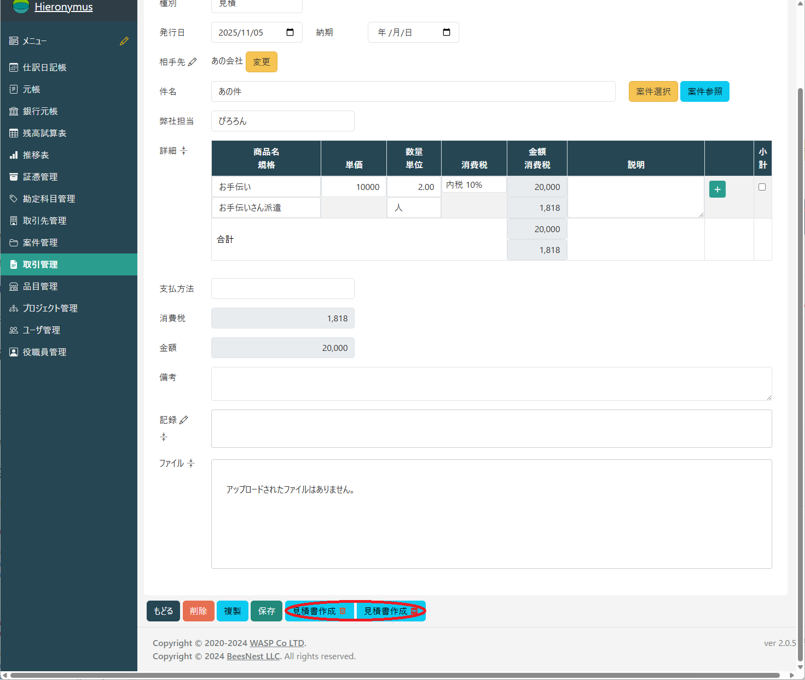
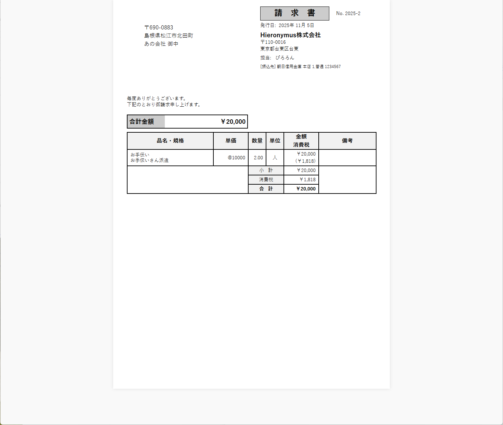

# 取引文書の作成と出力

顧客との取引で必要となる見積書、請求書、領収書といった各種の取引文書を作成し、出力・管理する機能です。

## 取引文書のワークフロー

取引文書は、以下の流れで作成するのが基本となります。

1.  **取引の登録:** まず、[取引・仕訳入力画面](/transaction/entry/)で、見積や請求の元となる取引内容（商品、数量、金額など）を登録します。
2.  **文書の選択と出力:** 登録した取引を選択し、出力したい文書の種類（見積書、請求書など）を選んで出力します。

.png)`

## 出力可能な文書種別

標準で出力できる主な文書は以下の通りです。これらの文書種別は、[ホーム画面](/home)の「取引文書種別」メニューで、名称や表示順をカスタマイズすることも可能です。

*   **差出見積書:**
    *   **用途:** 顧客に取引の金額や条件を提示するために使用します。
*   **差出請求書:**
    *   **用途:** 納品した商品や提供したサービスの対価を顧客に請求するために使用します。
*   **差出領収書:**
    *   **用途:** 顧客から代金を受け取ったことを証明するために発行します。

## 出力形式

各取引文書は、用途に応じて2つの形式で出力できます。

*   **画面表示 (HTML5):**
    *   Webブラウザで内容をすぐに確認したい場合に使用します。
    *   出力前に内容の最終チェックをするのに便利です。
*   **PDF:**
    *   印刷して郵送する場合や、電子メールに添付して送付する場合に使用します。
    *   改ざんされにくい、公式な書類形式です。

