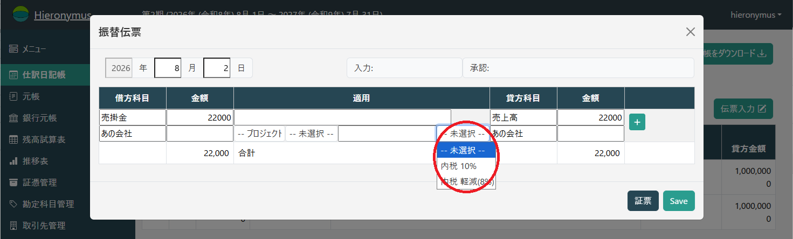
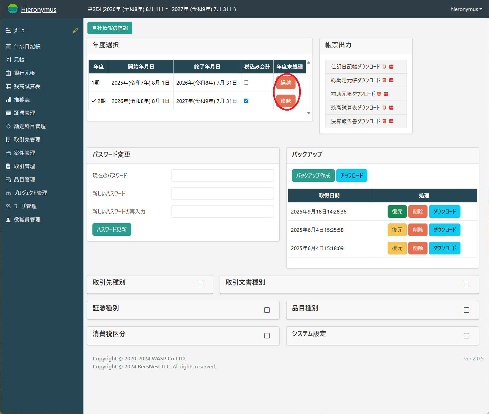

# 年度設定と繰越処理

## 消費税の扱いについての年度設定

消費税を税込会計にするか税抜会計にするかについては、年度毎に設定をします。

Hieronymusでは年度に対して以下のように設定します。

チェックを入れると税込会計となり、チェックがなければ税抜会計となります。

消費税の会計方式やHieronymus上での操作の違いについては、[消費税の扱い](./consumption-tax.md)を参照してください。

## 繰越処理

決算が終わると新年度が始まります。
新年度の会計を始める前には「繰越処理」を行って、新年度のデータが入力できるようにする必要があります。

年度繰越処理は「繰越」ボタンを押すだけです。

繰越処理では、

* 新しい年度用のデータ領域の作成(既にあれば行いません)
* 繰り越しのある勘定科目について繰越額を計算
* 繰越利益剰余金の計算

を行います。

**注意**

現在のところ繰越処理については**いつでも**できるようになっています。
つまり、決算処理そのものとの関連性はありません。

これは**決算処理が行われるのは前年度が終わってからですが、その時点では新年度の会計が始まってしまっている**からです。
決算完了前だと繰越額が不正確ですが、「繰越」ボタンを押せば再計算されるため、直接的な問題は発生しません。
また、伝票を改竄したりしない限りは、繰越処理は何度しても同じ結果になります。

ただし、繰越処理が反映されるのは翌年度だけですから、何らかの理由で過去に遡って繰越処理を行っても、すぐに最新の年度に反映するわけではありません。
必要であれば途中の年度も順に全て繰越処理を行ってください。