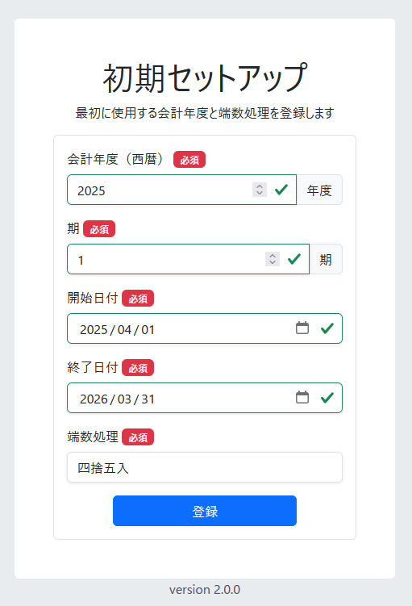

# 運用環境の設定

## 初期セットアップ

初めてログインすると、会計年度が設定されていないため、以下の初期セットアップ画面が表示されます。

ここで会計の基本情報を入力します。これらの項目は一度登録すると変更できないため、慎重に入力してください。

*   **会計年度**: 会計処理を開始する年度を入力します。（例: 2023）
*   **期**: 上記の会計年度が、会社の設立から数えて第何期にあたるかを入力します。
*   **開始日付**: 会計年度の開始日です。次年度以降もこの日付が基準となります。
*   **終了日付**: 会計年度の終了日です。次年度以降もこの日付が基準となります。
*   **端数処理**: 計算過程で1円未満の端数が出た場合の処理方法を選択します。
    *   切り捨て
    *   切り上げ
    *   四捨五入

    どれを選んでも構いませんが、一度設定したルールを期中で変更することは会計原則上推奨されません。

必要項目を入力して「登録」ボタンを押すと、ホーム画面に遷移します。

### 自社情報の登録

次に、画面上部に表示されている「自社の情報が登録されていません。登録してください。」という案内に従い、自社の情報を登録します。

「自社情報の登録」ボタンを押すと、情報登録画面に移動します。（Hieronymusでは、自社情報も取引先の一種として管理します）

.png)

「取引先種別」が「自社」になっていることを確認し、会社の情報を入力します。
システムを動作させる上で、最低限以下の項目は入力してください。

*   名前
*   呼び出しキー
*   郵便番号・住所
*   口座情報

入力が完了したら「保存」を押します。保存が成功すると「削除」ボタンが表示され、編集可能な状態になります。

.png)

この設定を終えると、ホーム画面の案内が消え、基本的なセットアップは完了です。

## 勘定科目の設定

左のメインメニューから「マスタ管理」>「勘定科目」を選択すると、勘定科目管理画面が開きます。

システムに予め必要最低限の勘定科目は登録されていますが、自社の運用に合わせて科目を追加することができます。

### 勘定科目追加の注意点

*   **削除不可**: 間違えて登録した科目や、使わなくなった科目を削除することはできません。登録は慎重に行ってください。
*   **分類の追加不可**: 「資産」「負債」などの大きな分類は追加・変更できません。この制約により、勘定科目を自由に追加しても、財務諸表の構造が壊れることはありません。
*   **科目と補助科目**: 新しい管理項目を「勘定科目」として追加するか、「補助科目」として既存の科目の下に作成するかは、会社の運用ルールや税理士の指導によって異なります。例えば、「普通預金」を銀行ごとに別の「勘定科目」とするか、「普通預金」の「補助科目」として各銀行を登録するかの判断がこれにあたります。

### 追加方法

1.  一覧の中から、追加したい科目が属する分類（例: 流動資産の預金）を見つけ、その行の右端にある「＋」ボタンを押します。

    .png)

2.  表示された画面で、新しい勘定科目の情報を入力します。

    *   **科目コード**: 選択した分類のコードを元に自動で採番されます。通常は意識する必要はありません。
    *   **検索キー**: 伝票入力の際に、このキーで科目を呼び出すことができます。伝票入力で頻繁に使う科目の場合は、入力しやすいキーを設定してください。

3.  「保存」をクリックすると、科目が追加されます。

    .png)

勘定科目はいつでも追加可能です。会計処理上、必要になったタイミングで随時追加してください。