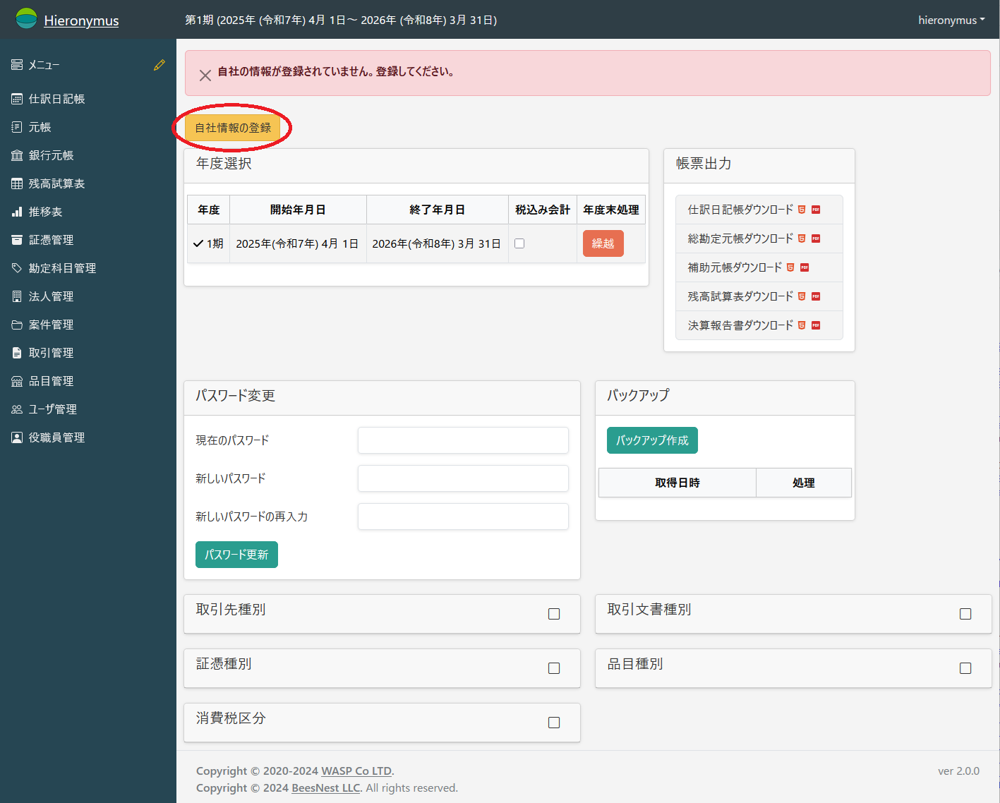
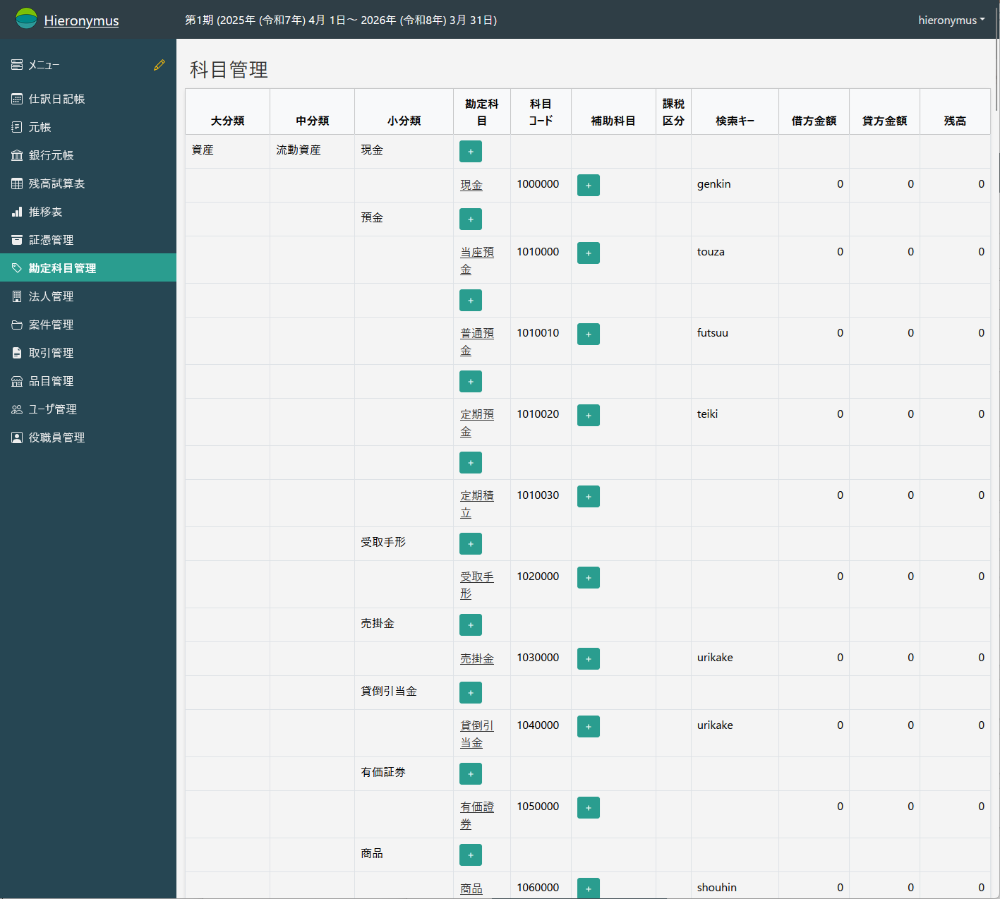

# 運用環境の設定
## 初期セットアップ

未使用の状態でログインすると、以下の画面となります。

ここで必要な情報を入力します。

* **会計年度**

  Hieronymusで扱う会計年度の最初の年を入れます。

* **期**

  会計年度が会社の第何期に相当するか入れます。
  Hieronymsは何期が終わった状態でも問題なく使えます。

* **開始日付**

  最初の会計年度の最初の日を入れます。
  次の会計年度はこの月日から始まります。

* **終了日付**

  最初の会計年度の最後の日を入れます。
  次の会計年度はこの月日で終わります。

* **端数処理**

  1円未満の端数が出た場合にどのように処理するかを入れます。
  設定可能なものは、

  * 切り捨て
  * 切り上げ
  * 四捨五入

  があります。
  とれを選んでも構いませんが、途中で変更すると税務署がうるさいので注意が必要です。
  たいていは「四捨五入」か「切り捨て」ではないかと思います。

これらは後から変更ができませんので、会社定款を確認したり税理士と相談したりして、慎重に入れてください。

これらを入力後「登録」ボタンを押すと、ホーム画面となります。

この時、画面上部には「自社の情報が登録されていません。登録してください。」と表示されています。
これは自社に関する情報(住所等)が未登録だからです。

自社の情報を登録するには、「自社情報の登録」というボタンを押して登録画面に入ってください。

すると、「法人等基本情報」の画面となります。

.png)

ここで、「取引先種別」が「自社」であることを確認して、自社の情報を登録します。

システム的な必須項目は、

* 名前
* 呼び出しキー
* 郵便番号住所
* 口座情報

ですから、最低限これらの項目は埋めてください。

.png)

入力が完了したら「保存」を押します。

.png)

保存が問題なく行われた場合は、「削除」ボタンが表れます。

.png)

ホーム画面では、

のようになり、

「自社情報の登録」が「自社情報の確認」と変わります。

.png)

これで最小限の利用前の設定は完了となります。

## 勘定科目の設定

左メニューの中程に「勘定科目管理」があります。

必要と思われる最低限の勘定科目は最初から設定されていますが、自社で使いたいと思うものがあるかどうかは、あらかじめ確認してください。

勘定科目は「追加(登録)」のみ可能です。
使わなくなった科目や間違えて登録した科目を削除することはできませんので、注意して登録してください。

「分類」への追加はできません。
これは「分類」への追加は諸表の集計に関わる重要な事柄だからなのですが、逆に言えばここは触れない分「勘定科目」への追加の範囲であればシステムが破綻することはありません(あった場合はバグなので報告してください)。
**システムの都合**を意識しないで、必要があればカジュアルに登録されて構いません。

科目を追加する時に、新規に勘定科目として追加するか補助科目として追加するかは、会計の流儀によるようで、どっちが正解というものではないようです。
たとえば、「普通預金」で口座毎に「勘定科目」にするか「補助科目」にするかは、「流儀」のようです。

「給与手当」を従業員毎に「補助科目」にしたいという話があったりします。
確かに補助科目で集計とか可能なので無意味とは言いませんが、入力が煩雑になる割には使いどころがないので、個人的にはお勧めしかねます。

そういった「やりたいこと」「やるべきこと」「やらない方がいいこと」なのがありますから、勘定科目の設定に関しては、**税理士と相談の上**判断をしてください。

勘定科目の追加は、「勘定科目」という桁にある「＋」ボタンを押します。
あちこちにありますが、それぞれ「分類」が異なりますので、**これから登録しようと思う科目に近い科目**にあるボタンを押してください。
「預金」のあたりにある「＋」を押すとこのようになります。

.png)

資産/流動資産/預金という分類に科目が追加できることがわかると思います。

科目コードは101の後に4桁続きます。
システム全体で科目コードを意識することはほぼありませんが(システムは「分類」で処理しています)、他システムと話を合わせる時に必要かも知れないので、一応意識してください。
これも税理士事務所で使っているコードに合わせると良いのかも知れません(弊社はしていません)。

「検索キー」は伝票入力で科目を選択する時に使うキーです。
必須項目としてのチェックはしていませんが、伝票に書かれる科目では必須項目だと思ってください。
逆に伝票に書かない科目(システムや決算のためにしか使わない科目)であれば、なくても構いません。

必要項目を埋めたら「保存」をクリックします。

.png)

勘定科目はいつでも追加可能です。
必要になれば随時追加してください。
ただし**削除はできません**ので、注意してください。
