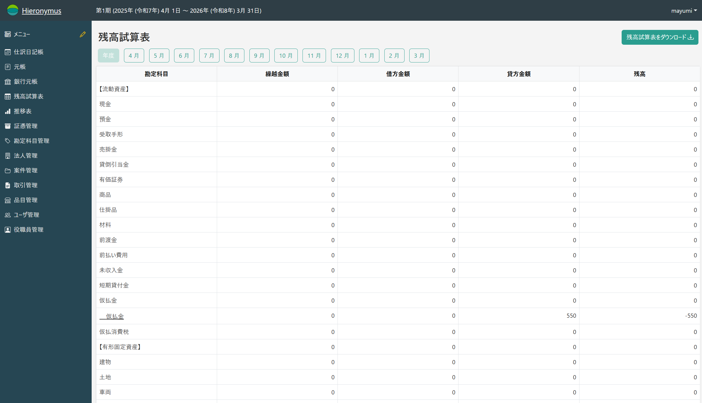
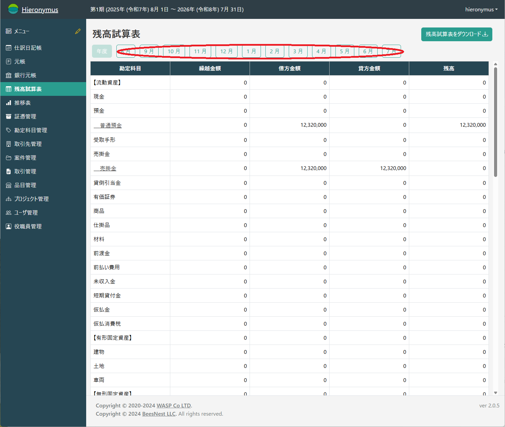
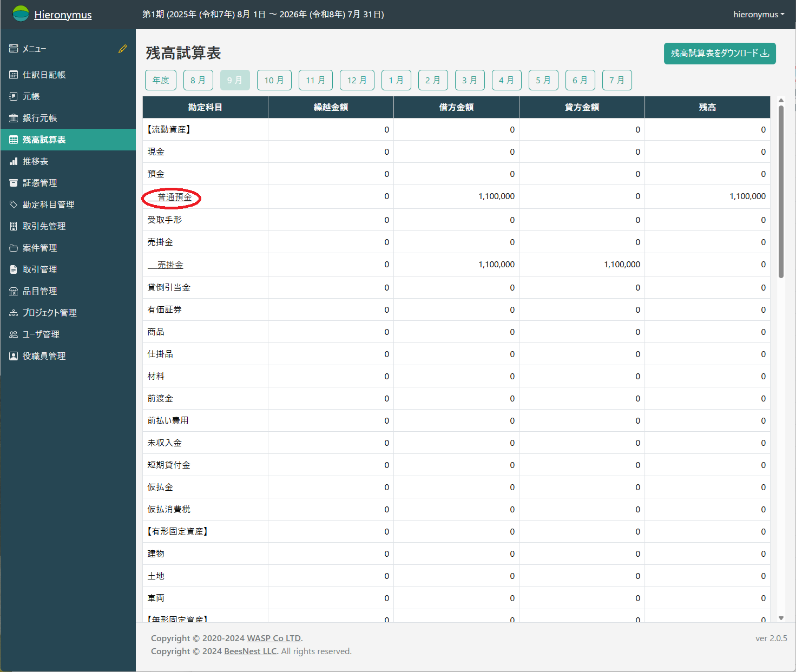
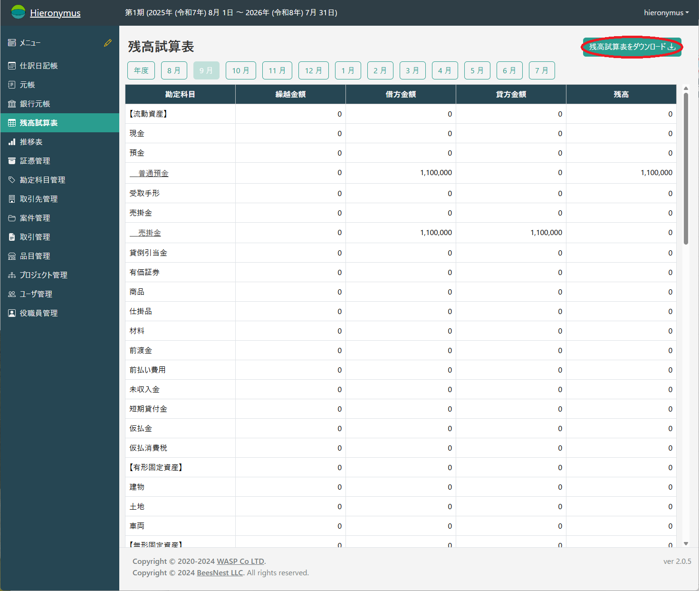

# 残高試算表

残高試算表は、指定した月の月末時点での、すべての勘定科目の残高を一覧表示する帳票です。
会計期間の途中での財務状況を概観したり、借方と貸方の合計が一致することを確認して、日々の仕訳が正しく行われているかを検証したりするために使用します。

## 残高試算表の表示

1.  左のメインメニューから「残高試算表」を選択します。

2.  初期状態では現在の会計年度の試算表を表示していますが、月次(月単位)の試算表が必要な場合は、画面上部に、現在の会計年度の月が一覧で表示されます。確認したい「月」をクリックしてください。

3.  選択した月の残高試算表が表示されます。

試算表は、上から資産、負債、純資産、収益、費用といった勘定科目の分類順に表示されます(その分類の全ての項目が0の場合は具体的な勘定科目は表示されません)。
各行には、以下の金額が表示されます。

*   **繰越金額**: 前月(前期)から繰り越された残高です。
*   **借方金額**: 選択した範囲内に、借方に記録された取引の合計金額です。
*   **貸方金額**: 選択した範囲内に、貸方に記録された取引の合計金額です。
*   **残高**: 末時点での最終的な残高です。

## 便利な機能

### 元帳へのドリルダウン

試算表の各行の勘定科目名（例: <u>&nbsp;&nbsp;&nbsp;普通預金</u>）はクリック可能なリンクになっています。

これをクリックすると、その勘定科目の「総勘定元帳」画面に直接移動することができます。試算表の残高がどのような取引によって構成されているのか、詳細な内訳をすぐに確認したい場合に便利です。

### PDFダウンロード

画面右上の「残高試算表をダウンロード」ボタンをクリックすると、表示されている試算表をPDFファイルとしてダウンロードすることができます。

