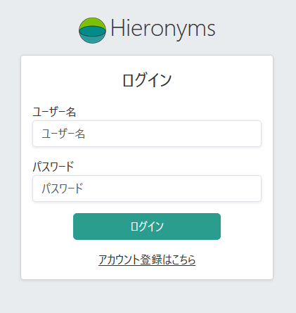
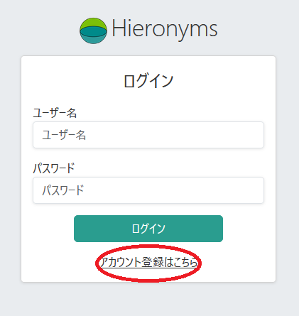
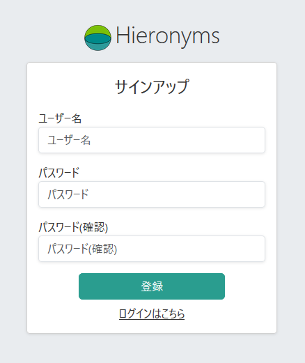
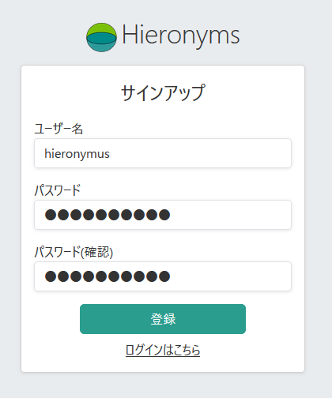
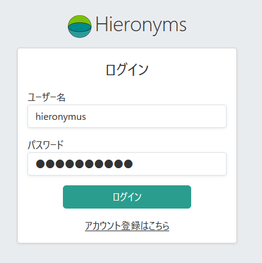

# アカウント登録

起動して画面を開くと、最初はログイン画面が表示されます。

初期アカウント等は設定されていませんので、アカウントを登録する必要があります。

ログインの時に自分でユーザ登録を行ってから使って下さい。

適当なユーザ名とパスワードを入れます。

ユーザー名は

* 英数字、- _ が使えます
* 一番最初に登録したユーザーは管理者権限を持っています
* 二番目以降に登録したユーザーは権限がほぼありませんので、「[ユーザー管理]()」で権限を付与する必要があります
* ユーザー名、パスワード共に特に長さの制限(○文字以上とか○文字以下とか)はありませんが、常識の範囲で設定してください
* ユーザー登録に認証や確認等の手順はありません。登録したらすぐ使えますが、入力を間違えたらそのままですから、もし間違えた場合は管理者に削除を依頼します
* パスワードはいつでも自分で変更できます
* 顧客対応の「担当者」はユーザー登録されている必要があります。システムを使わない人であっても、「担当者」となる人はユーザー登録しておいてください。
* 同様に将来追加される「労務管理」の対象者もユーザー登録されている必要があります。

登録すると、すぐにログイン画面になりますから、ログインします

